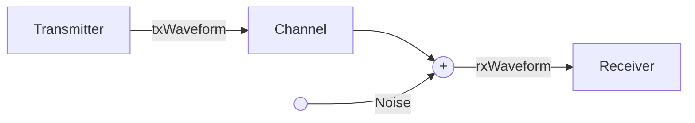

## **Overview**

In this project, a containerized server is already available. Your task is to implement a client as a Docker container. This client should receive data sent by the server, perform several signal processing steps, and save the results.

Create a private fork of the repository and follow the project structure shown in the template below. Mount the `results` folder into your container so that you can inspect the output files after running the client.

The server pushes data via ZMQ over an IPC socket. To communicate to this socket from the client side you need to mount `/tmp` to the client container. Then the server can be reached under the namespace `/tmp/comsock`. The server serializes the data using Protobuf, you can see the message structure in `waveform.proto`. A message is either of type `tx` or `rx`, containing `txWaveform` or `rxWaveform`, respectively.

Both fields contain binary 16-bit IQ samples (interleaved IQIQIQ...). These samples must be deserialized and converted into complex baseband signals.  
- `txWaveform` represents the transmitted signal  
- `rxWaveform` represents the received signal  

The signals are OFDM-modulated 5G SRS waveforms sampled at `fs = 122.88 MHz`. The block diagram shows the underlying channel model.

### **Signal Model**



## Subtask 1
Plot the transmit and receive signals side-by-side in the time domain.  
Save the figure as:  
`client/results/task1.png`

## Subtask 2
Synchronize the received signal with the transmitted signal.  
Plot the transmit signal and the synchronized receive signal as an overlay, and save it as:  
`client/results/task2.png`

## Subtask 3
Demodulate the synchronized receive signal.  
You may use the Python library `py3gpp`, which provides an appropriate OFDM demodulator.

Use the following parameters:  
- **carrier:** `NCellID = 1`, `NSizeGrid = 275`, `SubcarrierSpacing = 30`  
- **sampling rate:** `fs = 122.88 MHz`

The demodulator outputs an OFDM grid.  
Plot the TX and RX grid side-by-side as images and save them as:  
`client/results/task3.png`

## Subtask 4
Perform a channel estimation in the frequency domain using the TX and RX grid.  
Plot the channel amplitude and phase response side-by-side and save as:  
`client/results/task4.png`

## **Project Structure**

```
├── README.md
├── docker-compose.yml
├── client
│   ├── Dockerfile
│   ├── requirements.txt
│   ├── results
│   │   ├── task1.png
│   │   ├── task2.png
│   │   ├── task3.png
│   │   └── task4.png
│   └── src
│       ├── gen
│       │   └── waveform_pb2.py
│       └── signal_processing.py
└── server
```

## **Submission**
When you are finished, invite me (**username: till**) to your private fork so I can review your work.<br>
If you dont have anough time or you can only complete part of the tasks, feel free to submit your partial solution, there is still a good chance to be invited to an interview.<br>
After the application deadline, submissions will be reviewed and a notification will be sent in the following weeks.<br>
Have fun :smirk:!

